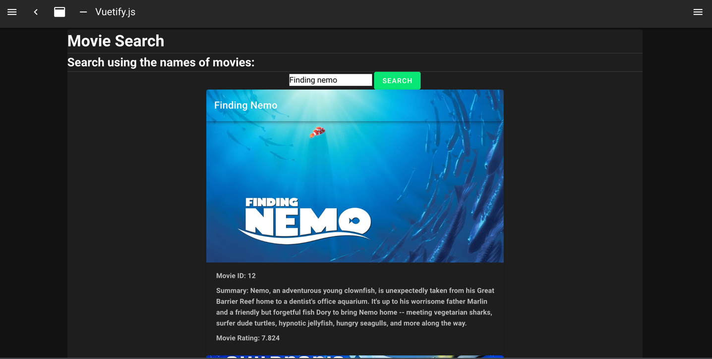
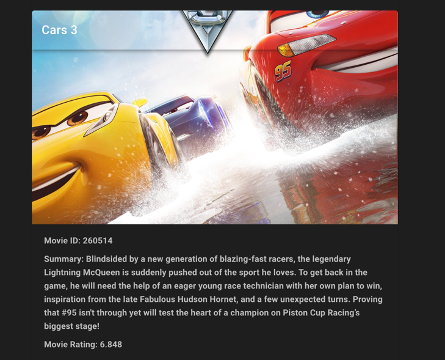

## Post OITInterview-Movie
After doing the OIT Interview coding challenge, I went back and spent the same amount of time I did trying to get vue and nuxt working. 
and tried again. This attempt turned out to be much more successful. I struggled with the front end for about 2 1/2 hours during the 4 hour challenge (Most of that 2 1/2 segment was spent trying to get nuxt and vue configured correctly, but to no success). 
On this attempt, it only took me 2 hours. I'm very happy with the conclusion. This attempt went much better due to computer I was running on. I did the coding challenge on my work computer, which had the wrong node version and few other erros. My home computer turned out to work much better with the framework. I felt that it was justified to give it another shot when most of the time spent was just on getting nuxt working and not actually coding. However, I understand that the challenge was to test me against new frameworks and learning, this is why I put it on a seperate branch. I hope you will consider me for the position with this version of the application.

To get it running. Run the backend with a env variable MOVIE_KEY as your TMDB Key, this is for the movie database api.
The backend should be on port 8080
Next ( or should I say nuxt, becuase thats the next step), run 'npm run i' in the webapp directory, the 'npm run dev',
The front end should be on port 3000. 
Head there and try it out!
Here are a few screenshots of what it should look like!

